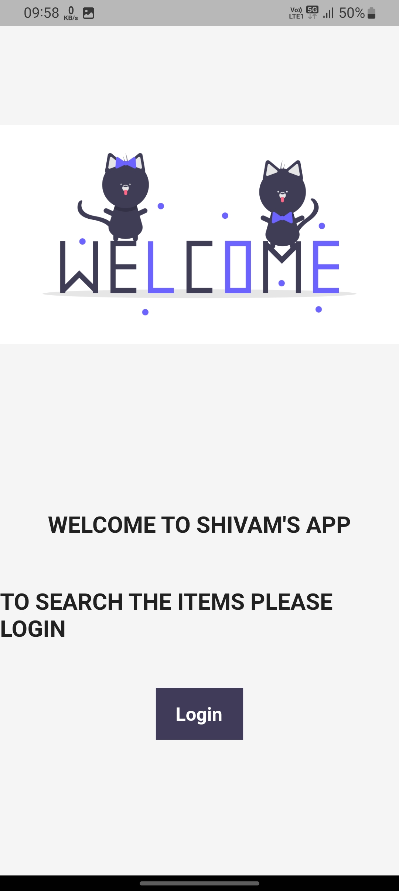
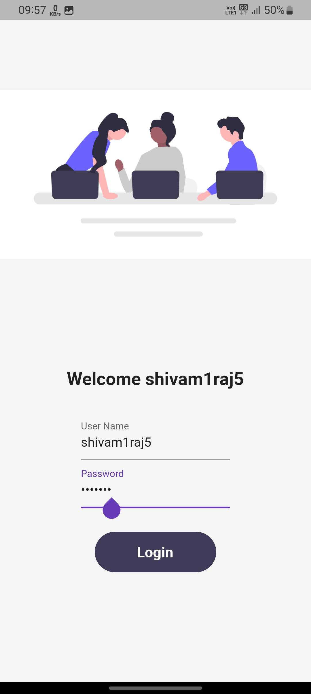
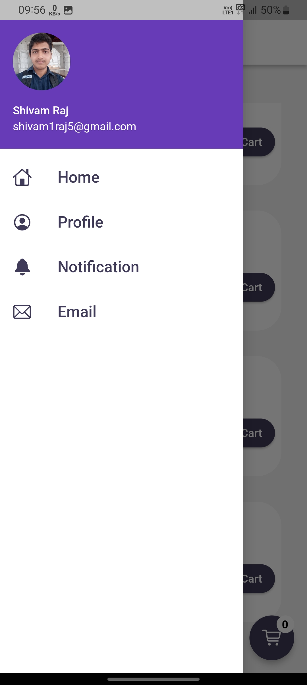
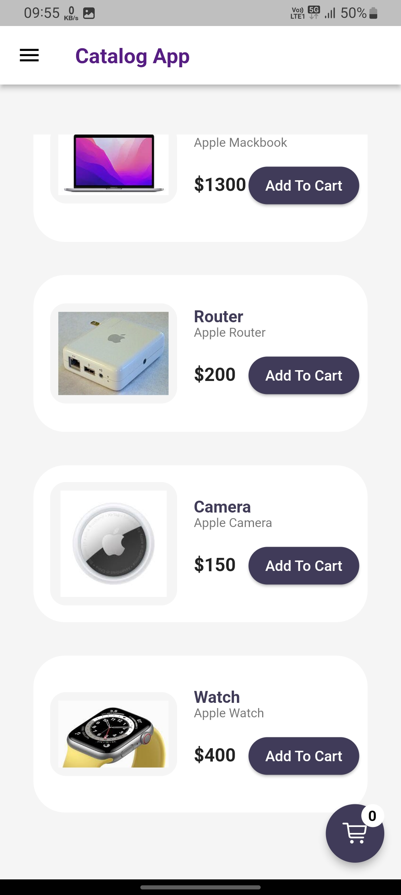
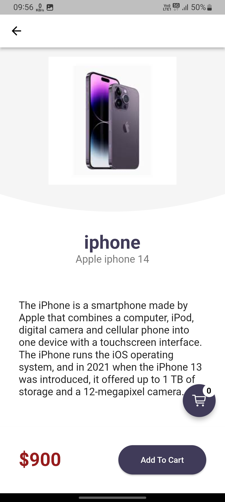
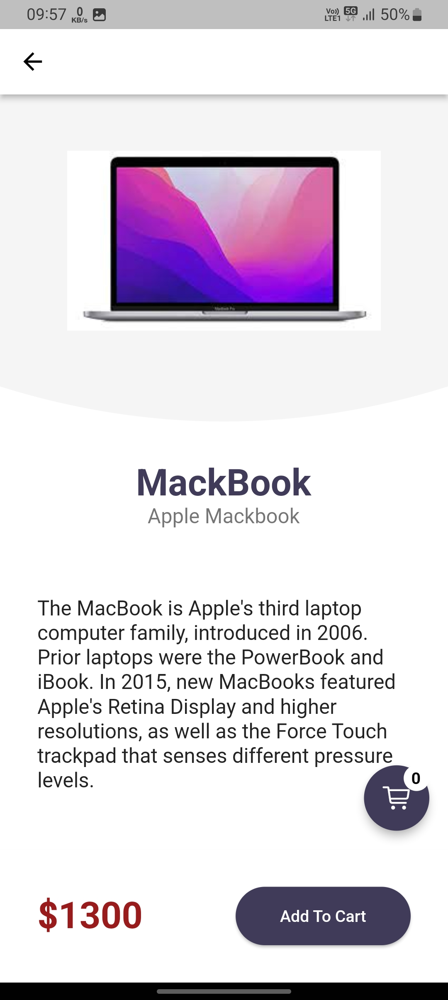
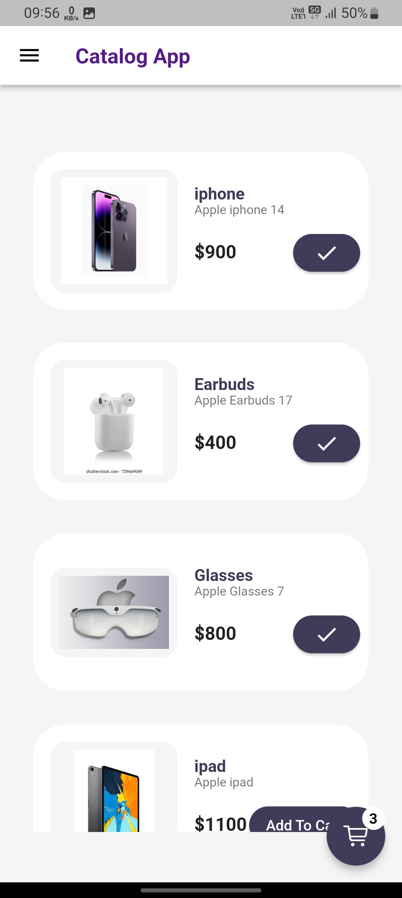
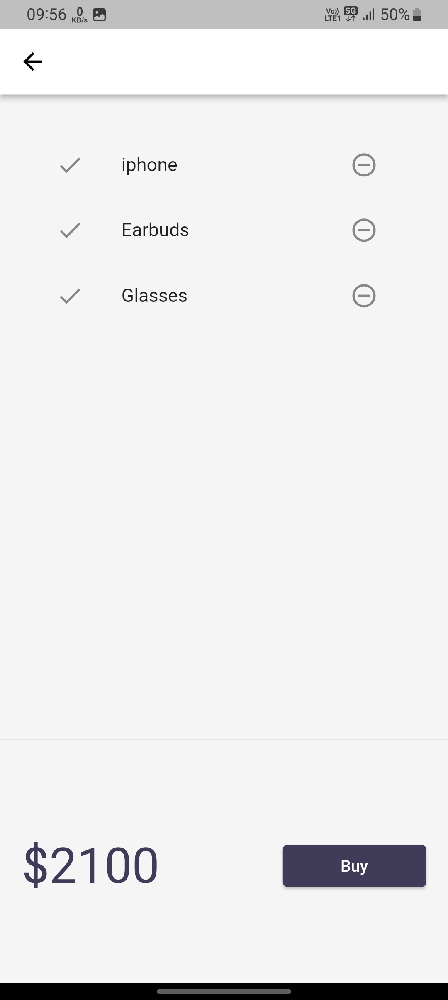

# Catalog App

• Developed a platform-independent e-Commerce application using Flutter, a cross-platform framework. 
• Enforced Firebase authentication, retained session state, and efficiently managed carts.

## Getting Started

This project is a starting point for a Flutter application.

A few resources to get you started if this is your first Flutter project:

- [Lab: Write your first Flutter app](https://docs.flutter.dev/get-started/codelab)
- [Cookbook: Useful Flutter samples](https://docs.flutter.dev/cookbook)

For help getting started with Flutter development, view the
[online documentation](https://docs.flutter.dev/), which offers tutorials,
samples, guidance on mobile development, and a full API reference.

## 📷 Previews

 

 

